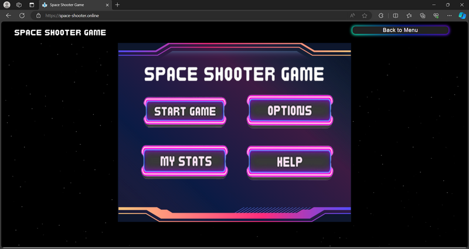
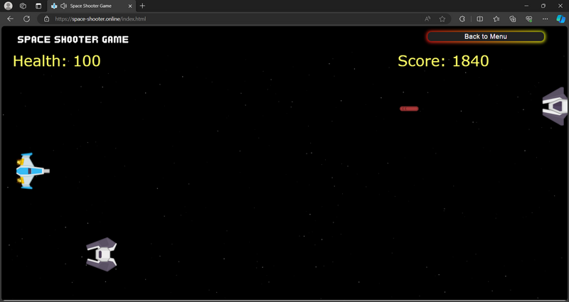

# 🧩 Project-SDA

This project is a web application developed by 4th-year Computer Engineering students at Prince of Songkla University. It demonstrates the integration of HTML, CSS, and JavaScript with multimedia assets, organized in a Docker-ready environment.

---

## 👥 Team Members

- **Thanaphum Bubaso** (6510110194)
- **Phoorin Nickphong** (6510110371)
- **Natcha Laeplangkaew** (6510110132)

---

## 🧰 Technologies Used

- **HTML** – Web content structure
- **CSS** – Styling and layout
- **JavaScript** – Frontend logic
- **Docker** – For containerized deployment
- **Images & Sound Assets** – For UI and interactive features

---

## 📁 Project Structure

```
Project-SDA/
├── css/              # Stylesheets
├── js/               # JavaScript functionality
├── images/           # UI images and illustrations
├── sound/            # Sound effects
├── index.html        # Main entry point
├── Dockerfile        # Deployment setup
└── README.md
```

---

## 🚀 How to Run

### 1. Run with Docker

```bash
docker build -t project-sda .
docker run -p 8080:80 project-sda
```

Then open your browser at: [http://localhost:8080](http://localhost:8080)

### 2. Run Locally (Without Docker)

```bash
cd Project-SDA
python -m http.server
```

---

## 🖼️ Screenshots

<p align="center">
  
</p>

<p align="center">
  
</p>

---

## 🎯 Highlights

- Clean and modular web app architecture
- Designed and built entirely by students
- Includes sounds, images, and interactive elements
- Easy deployment with Docker

